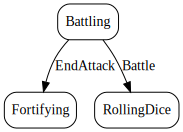

# Battle

*Select a territory to attack, neighboring defending territory, and dice to roll*

The objective of battling is to capture an opponent's territory by defeating all of its armies.
To attack, you must select an attacking territory that
When you attack, you must decide to roll 1, 2, or 3 dice. You can roll no more dice than one more than the number of armies on the attacking territory. For example, if you are attacking from a territory with three armies, you may only roll two dice.

  

## Action Object Format
The Battle actions must contain the following:

Field        | Type       | Description
------------ | ---------- | -----------
`type`     | `string` | "Battle"
`attackingTerritoryIndex` | `number` | index of attacking territory
`defendingTerritoryIndex` | `number` | index of defending territory
`attackingDiceCount` | `number` | number of dice to be rolled by attacker

## Action creator
`battle(attackingTerritoryIndex: number, defendingTerritoryIndex: number, attackingDiceCount: number)`

  
  