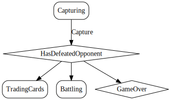

# Capture
Capture the defeated territory by moving armies into it

  

## Action Object Format
The Capture actions must contain the following:

Field        | Type       | Description
------------ | ---------- | -----------
`type`     | `string` | "Capture"
`armies` | `number` | {number} - number of armies to move

## Action creator: `capture(armies: number)`

  
  