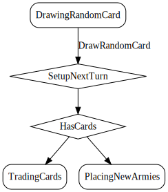

# DrawRandomCard

*Select "random" card for player to draw from the deck.*

Simulate player drawing a random card from the deck.

  

## Action Object Format
The DrawRandomCard actions must contain the following:

Field        | Type       | Description
------------ | ---------- | -----------
`type`     | `string` | "DrawRandomCard"
`cardIndex` | `number` | Index of the card to assign. Card owner must be currently undefined.

## Action creator
`drawRandomCard(cardIndex: number)`

  
  