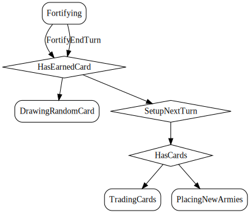

# EndTurn

*You end the turn, ending fortification.*

End turn without fortifying.

  

## Action Object Format
The EndTurn actions must contain the following:

Field        | Type       | Description
------------ | ---------- | -----------
`type`     | `string` | "EndTurn"

## Action creator
`endTurn()`

  
  