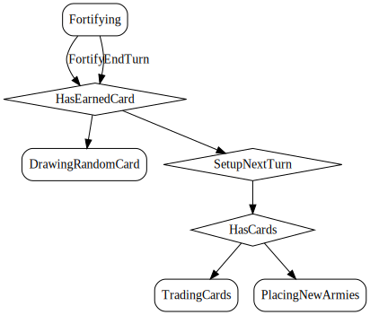

# Fortify
Move armies between two of your adjacent territories before ending your turn.

  

## Action Object Format
The Fortify actions must contain the following:

Field        | Type       | Description
------------ | ---------- | -----------
`type`     | `string` | "Fortify"
`fromTerritoryIndex` | `number` | Index of territory to move armies from. Must  be owned by you, have more than one army, and be adjacent to toTerritoryIndex.
`toTerritoryIndex` | `number` | Index of territory to move armies to. Must be  owned by you and adjacent to fromTerritoryIndex.
`armies` | `number` | Number of armies to move. You must leave one army behind,  so the number may between one and the number of the armies on fromTerritoryIndex.

## Action creator: `fortify(fromTerritoryIndex: number, toTerritoryIndex: number, armies: number)`

  
  