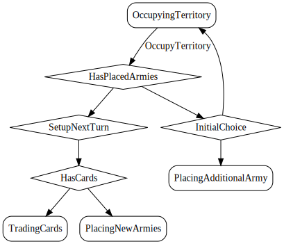

# OccupyTerritory

*Select territory to occupy.*

At the start of the game, each player takes turns placing a single army on an unoccupied territory.
To occupy the territory, you must place an army on an unoccupied territory. An unoccupied territory must have no owner or occupying armies.
Upon occupying the territory

  

## Action Object Format
The OccupyTerritory actions must contain the following:

Field        | Type       | Description
------------ | ---------- | -----------
`type`     | `string` | "OccupyTerritory"
`territoryIndex` | `number` | Index of territory to occupy. It must be unoccupied.

## Action creator
`occupyTerritory(territoryIndex: number)`

  
  