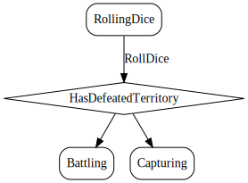

# RollDice

*Simulate attacker and defender rolling dice.*

Simulate players rolling dice.
The attacker and defender may loose armies based on the random outcome of the dice rolled. Compare the highest die rolled by the attacker and defender - if the attacker's die is higher the defending territory looses an army, otherwise the attacker looses an army. If the attacker and defender rolled two or more dice, compare the second highest pair. If the attacker's die is higher the defending territory looses an army, otherwise the attacker looses an army.
The owner of the defending territory may roll a single die when the defending territory contains a single army. When the territory contains multiple armies, the defender may roll either one or two dice.

  

## Action Object Format
The RollDice actions must contain the following:

Field        | Type       | Description
------------ | ---------- | -----------
`type`     | `string` | "RollDice"
`attackerDice` | `undefined` | dice rolled by attacker
`defenderDice` | `undefined` | dice rolled by defender

## Action creator
`rollDice(attackerDice: undefined, defenderDice: undefined)`

  
  