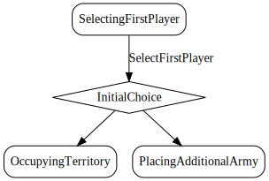

# SelectFirstPlayer

*Select player to take first move, similarly to each player rolling a die
to begin the game.*

Select player to take first move, similarly to each player rolling a die to determine the first player at the beginning the game.


  

## Action Object Format
The SelectFirstPlayer actions must contain the following:

Field        | Type       | Description
------------ | ---------- | -----------
`type`     | `string` | "SelectFirstPlayer"
`firstPlayerIndex` | `number` | Index of the first player.


## Action creator
`selectFirstPlayer(firstPlayerIndex: number)`


### Example
```javascript
let state = stateMachine.reduce();
let action = actionCreators.startMatch(3);
state = stateMachine.reduce(state, action);
action = actionCreators.selectFirstPlayer(0);
state = stateMachine.reduce(state, action);
```
  
  
  