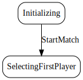

# StartMatch

*Start the match.*

Start match
The number of players determines the number of armies each player receive. The traditional rules award each player the number shown in this table. However, this may vary based on the match settings.


  

## Action Object Format
The StartMatch actions must contain the following:

Field        | Type       | Description
------------ | ---------- | -----------
`type`     | `string` | "StartMatch"
`playerCount` | `number` | Number of players. The match settings determine the minimum and maximum number of players.


## Action creator
`startMatch(playerCount: number)`


```javascript
let state = stateMachine.reduce();
let action = actionCreators.startMatch(3);
state = stateMachine.reduce(state, action);
```
  
  
  