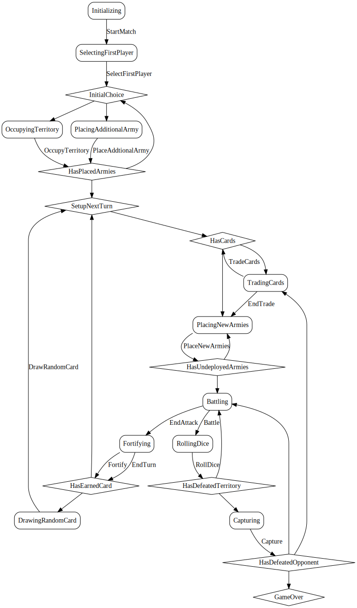

Gameplay includes numerous phases.
The following diagram illustrates the states and transitions as a state machine.

This diagram contains several elements.
* _Boxes_ are states where the match is waiting on a player interaction, such as rolling the dice.
* _Diamonds_ are pseudostates, such as the branch in the flow when a player wins the game.
* _Lines_ are transitions.

## Actions
* [StartMatch](actions/startmatch.html)
* [SelectFirstPlayer](actions/selectfirstplayer.html)
* [OccupyTerritory](actions/occupyterritory.html)
* [PlaceAdditionalArmy](actions/placeadditionalarmy.html)
* [TradeCards](actions/tradecards.html)
* [EndTrade](actions/endtrade.html)
* [PlaceNewArmies](actions/placenewarmies.html)
* [Battle](actions/battle.html)
* [RollDice](actions/rolldice.html)
* [EndAttack](actions/endattack.html)
* [Capture](actions/capture.html)
* [Fortify](actions/fortify.html)
* [EndTurn](actions/endturn.html)
* [DrawRandomCard](actions/drawrandomcard.html)
  